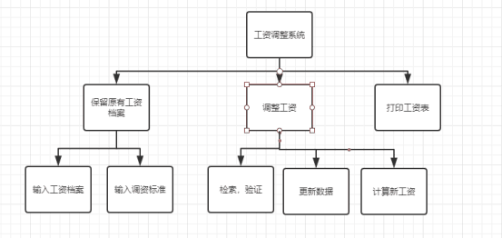
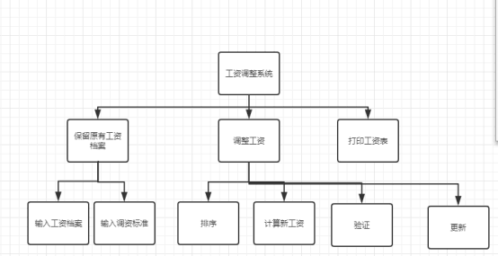

# 一、	任务概述    #
## 1.	需求说明   ##
（1）功能需求：可以输入调资标准，输入教师档案，存储档案，经过调资系统给出新的教师档案。

（2）性能需求：软件响应时间要快即处理速度要快

（3）灵活需求：当需求发生变化时，例如调资标准，软件要能够，适应这些变化

（4）故障处理要求：出现错误时，有警告或者提示
## 2.	数据流图    ##

## 2.	HIPO图   ##
